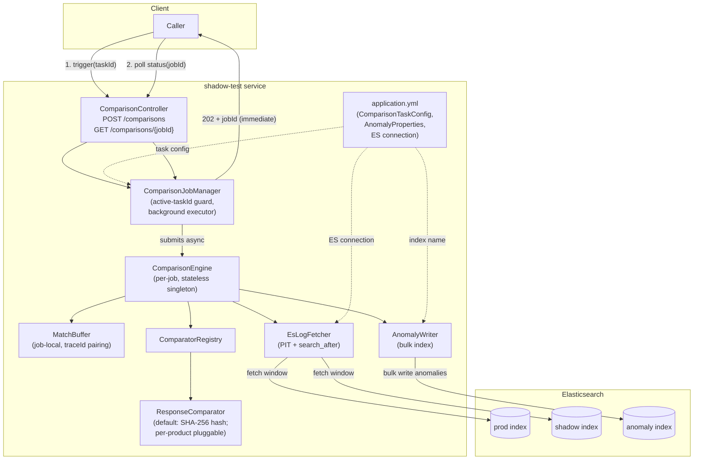
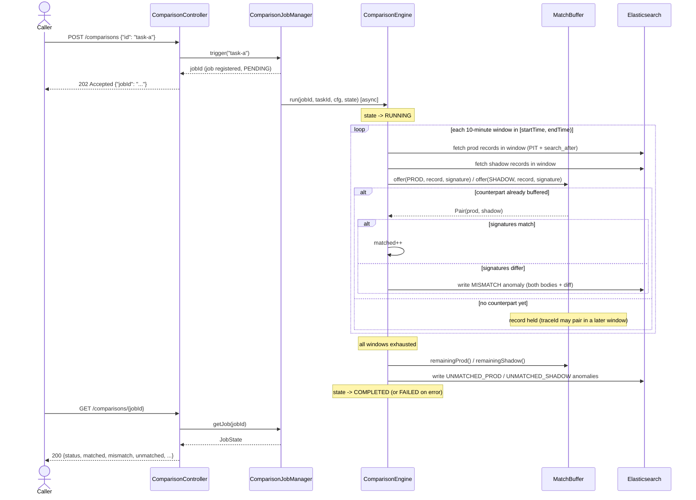

# shadow-test

A Java 21 + Spring Boot 3 service for shadow-test analysis: it compares **prod** and **shadow** response logs stored in Elasticsearch, pairs them by `traceId`, and writes any mismatches or unmatched records back to Elasticsearch as anomalies.

## System Architecture



### Components

| Component | Responsibility |
|---|---|
| `ComparisonController` | REST API: trigger a job, poll its status |
| `ComparisonJobManager` | Validates the task id, rejects unknown/duplicate-in-flight ids, runs the job asynchronously, tracks `JobState` |
| `ComparisonEngine` | Orchestrates one job: iterates time windows, fetches, pairs, compares, writes anomalies |
| `MatchBuffer` | Per-job in-memory buffer pairing prod/shadow records by `traceId`, holding full records so pairs can span windows |
| `EsLogFetcher` | Fetches all matching records for one index/window using Point-In-Time + `search_after` pagination |
| `ResponseComparator` / `ComparatorRegistry` | Pluggable per-product comparison strategy; default hashes the response body |
| `AnomalyWriter` | Bulk-writes `Anomaly` records to the configured anomaly index |
| `ComparisonTaskProperties` / `AnomalyProperties` | `application.yml`-driven configuration (index names, field mappings, ES connection) |

## Data Flow



**Key behaviors:**

- **Windowed fetch, not one big pull.** The configured `[startTime, endTime)` range is split into `windowMinutes`-sized chunks (default 10 min) and fetched one window at a time, so large ranges never load everything into memory at once.
- **Cross-window pairing.** The same `traceId` can appear in prod and shadow at different times (different windows). Unpaired records are held in `MatchBuffer` — a job-local, in-memory map — until their counterpart shows up in a later window, or until the range is exhausted (at which point they become `UNMATCHED_*` anomalies). Records are kept in full (including body) so a mismatch or unmatched anomaly can be reported with complete data, no re-fetch needed.
- **Per-product comparison.** Each task's `product` resolves to a `ResponseComparator` via `ComparatorRegistry`. The default reduces a record to a SHA-256 hash of its body; a product can register its own `@Component ResponseComparator` bean (e.g. to ignore a volatile field before hashing) and it's picked up automatically by product name.
- **Job isolation.** Every job gets its own `MatchBuffer` and counters (no shared mutable state), and `ComparisonJobManager` refuses to start a second job for a task id that's already running — so multiple products can be compared concurrently without interfering with each other. Anomalies are tagged with `jobId`, `taskId`, and `product`.

## API

Base path: `/comparisons`

### `POST /comparisons` — trigger a comparison job

**Request body:**

```json
{ "id": "demo-product" }
```

`id` must reference a task key configured under `comparison.tasks.*` in `application.yml`.

**Responses:**

| Status | When | Body |
|---|---|---|
| `202 Accepted` | Job accepted, running in the background | `{ "jobId": "<uuid>" }` |
| `400 Bad Request` | `id` is blank, or doesn't match any configured task | `{ "error": "unknown task id: ..." }` |
| `409 Conflict` | A job for this same task `id` is already running | `{ "error": "comparison already running for task id: ..." }` |

The endpoint returns immediately — it never blocks on the actual comparison work.

### `GET /comparisons/{jobId}` — poll job status

**Responses:**

| Status | When | Body |
|---|---|---|
| `200 OK` | Job exists | `JobStatusResponse` (below) |
| `404 Not Found` | No job with this id | *(empty)* |

**`JobStatusResponse`:**

```json
{
  "jobId": "3f2a1e...",
  "taskId": "demo-product",
  "product": "demo",
  "status": "RUNNING",
  "currentWindow": 4,
  "totalWindows": 12,
  "matched": 118,
  "mismatch": 2,
  "unmatched": 0,
  "error": null
}
```

| Field | Meaning |
|---|---|
| `status` | `PENDING` \| `RUNNING` \| `COMPLETED` \| `FAILED` |
| `currentWindow` / `totalWindows` | Progress through the configured time range |
| `matched` | Pairs whose comparator signatures matched |
| `mismatch` | Pairs whose comparator signatures differed (written as `MISMATCH` anomalies) |
| `unmatched` | Total leftover records on both sides after the full range (written as `UNMATCHED_PROD`/`UNMATCHED_SHADOW` anomalies) |
| `error` | Exception message if `status` is `FAILED`, otherwise `null` |

## Configuration

Comparison tasks, the anomaly index name, and the Elasticsearch connection are all configured in `application.yml`:

```yaml
elasticsearch:
  host: localhost
  port: 9200
  scheme: http
  username:
  password:

anomaly:
  index-name: shadow-test-anomalies   # where MISMATCH/UNMATCHED anomalies are written

comparison:
  tasks:
    demo-product:                # <- this key is the "id" the trigger API expects
      product: demo               # resolves a ResponseComparator by product name
      prod-index: prod-responses
      shadow-index: shadow-responses
      host: api.example.com        # host to filter on within each log's host-field
      host-field: host             # ES field name holding the host
      time-field: "@timestamp"     # ES field name holding the timestamp
      trace-id-field: traceId      # ES field name holding the trace id
      body-field: responseBody     # ES field name holding the response body
      window-minutes: 10           # size of each fetch window
      page-size: 500               # search_after page size
      start-time: "2026-07-13T00:00:00Z"  # comparison range start (ISO-8601)
      end-time: "2026-07-13T01:00:00Z"    # comparison range end (ISO-8601)
```

Multiple task entries can be defined under `comparison.tasks`; each is triggered independently by its key.

> **Note:** if `host-field` maps to an analyzed (`text`) Elasticsearch field, point it at the field's `.keyword` subfield (e.g. `host.keyword`) so the exact-match filter behaves correctly.

## Adding a custom per-product comparator

```java
@Component
public class OrdersComparator implements ResponseComparator {
    @Override
    public String product() { return "orders"; }

    @Override
    public Signature signature(LogRecord record) {
        // e.g. normalize out a volatile field before hashing
        String normalized = record.rawBody().replaceAll("\"timestamp\":\"[^\"]*\"", "");
        return new Signature(sha256Hex(normalized));
    }
}
```

`ComparatorRegistry` picks up any `ResponseComparator` bean automatically and routes to it by `product()`; tasks whose `product` doesn't match a registered comparator fall back to the default hash comparator.

## Building & Testing

```bash
mvn test      # 43 unit tests
mvn verify    # + 4 Testcontainers integration tests against a real Elasticsearch 8.x container
```

See the full design document for further detail: [`docs/superpowers/plans/2026-07-13-shadow-test-comparison.md`](docs/superpowers/plans/2026-07-13-shadow-test-comparison.md).
